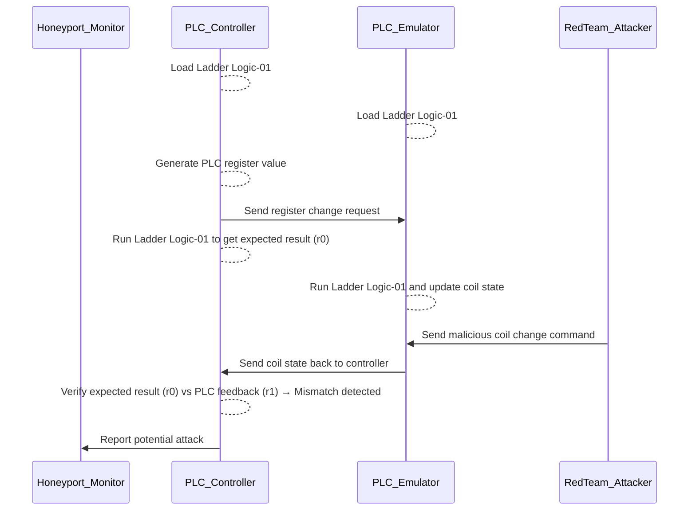
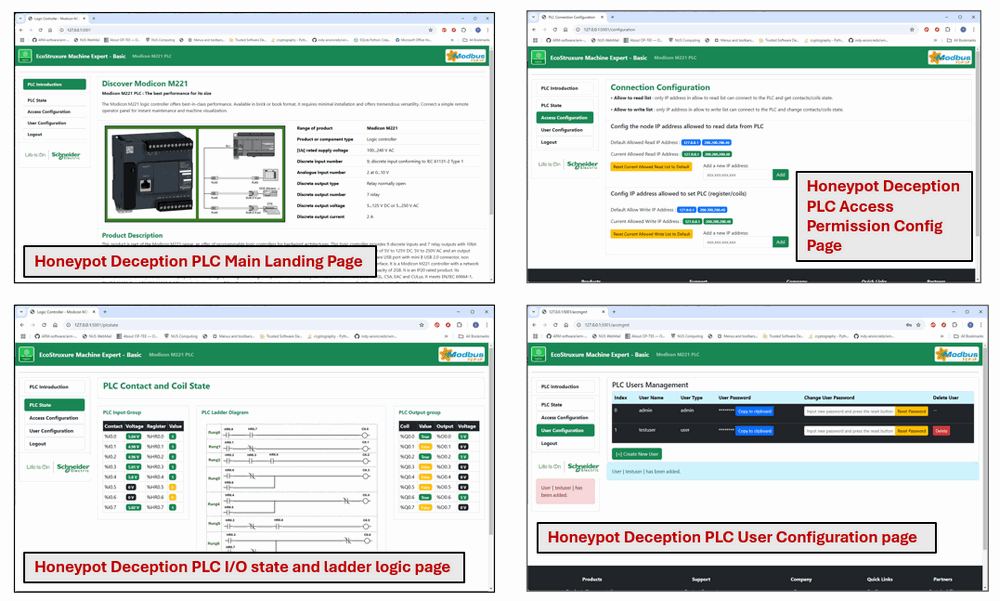
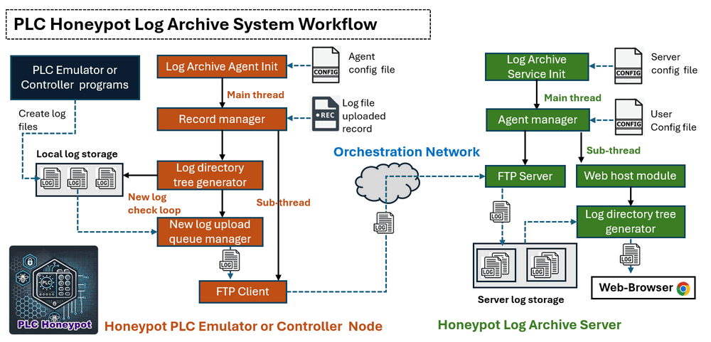
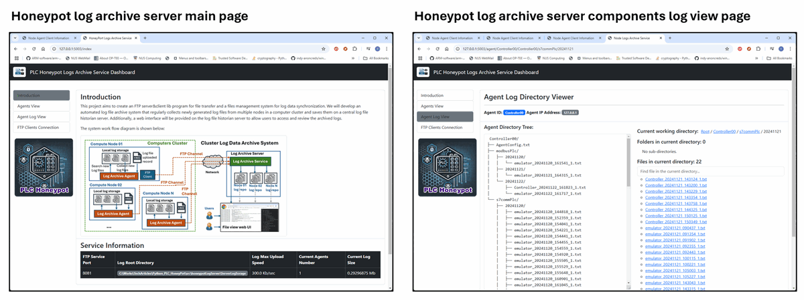
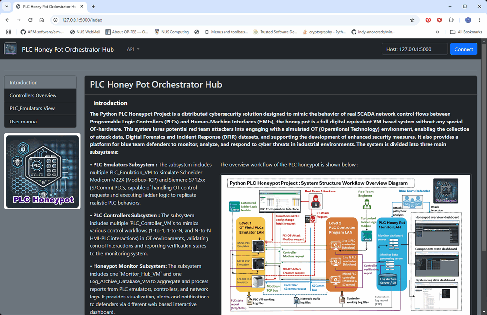
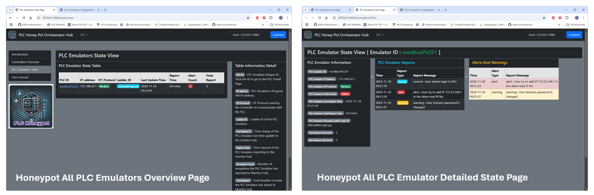
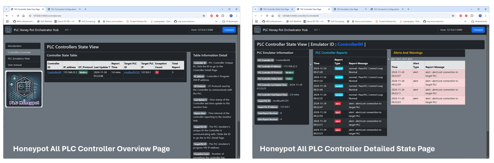
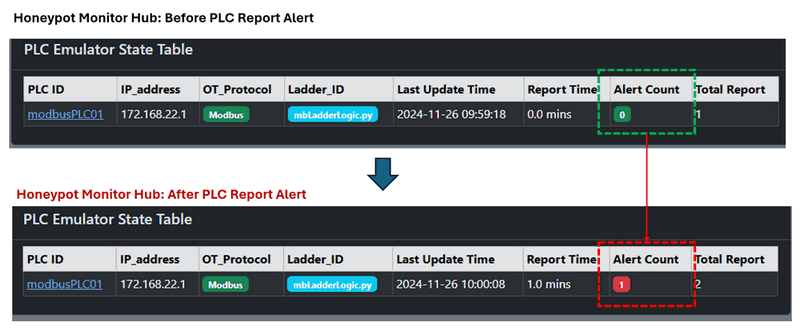
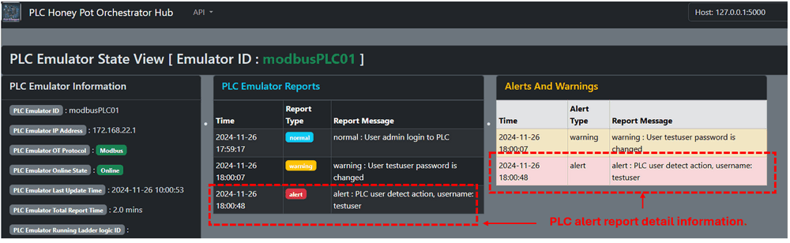
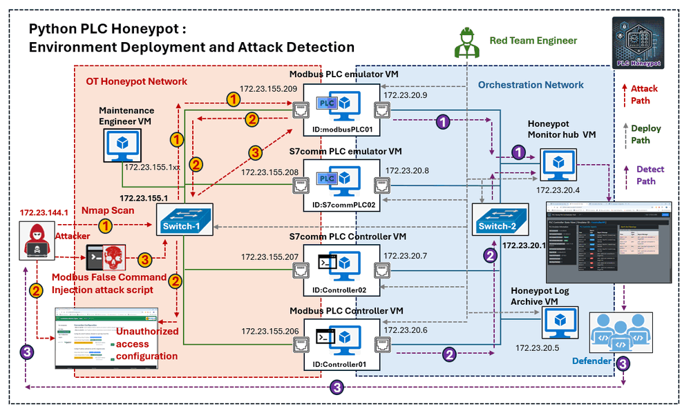

# Python PLC Honeypot Project


**Program Design Propose** : This project aims to develop a sophisticated honeypot system that emulates an OT (Operational Technology) SCADA network environment, bridging Level 1 OT field controller devices (PLCs) with Level 2 control programs, including Human-Machine Interfaces (HMIs). This honeypot will simulate various PLC models from major vendors, such as Schneider and Siemens, while supporting the primary communication protocols `Modbus-TCP` and `Siemens-S7Comm`. The system will integrate essential components: PLC emulator, OT controller simulator, ladder logic verifier, data logger, attack detector and system monitor. 

As a cybersecurity honeypot, the system will detect unauthorized access attempts on PLCs, including attempts to log in to PLC configuration pages via HTTP/HTTPS, send the OT control request, and fetch PLC state data. The orchestrator will monitor for possible attack scenario such as Denial of Service (DoS),  False Command Injection (FCI) and False Data Injection (FDI) attacks. The system will log and display real-time data on system execution states, enabling blue teams defenders to monitor and analyze attacker or red team behaviors. Designed for cybersecurity training, cyber defense exercises, Capture the Flag (CTF) challenges, and hands-on attack/defense competitions, this PLC honeypot provides a realistic and interactive platform for advancing OT cybersecurity skills and strategies.

```
# Created:     2024/10/28
# Version:     v_0.1.3
# Copyright:   Copyright (c) 2024 LiuYuancheng
# License:     GNU Affero General Public License v3.0    
```

**Table of Contents**

[TOC]

- [Python PLC Honeypot Project](#python-plc-honeypot-project)
    + [Introduction](#introduction)
      - [System Network Introduction](#system-network-introduction)
      - [System Key Features Introduction](#system-key-features-introduction)
    + [Design of PLC Emulator](#design-of-plc-emulator)
    + [Design of PLC Controller](#design-of-plc-controller)
    + [Design of Deception Layer](#design-of-deception-layer)
    + [Design of Data Log System](#design-of-data-log-system)
    + [Design of Honeypot Monitor Hub](#design-of-honeypot-monitor-hub)
    + [Design of Attack Alert and Notification Function](#design-of-attack-alert-and-notification-function)
    + [System Setup](#system-setup)
    + [System Deployment and Usage](#system-deployment-and-usage)
    + [Reference Link](#reference-link)


------

### Introduction

The Python PLC Honeypot Project is a distributed cybersecurity solution designed to mimic the behavior of real SCADA network control flows between Programable Logic Controllers (PLCs) and Human-Machine Interfaces (HMIs), the honey pot is a full digital equivalent VMs based system without any special OT-hardware (user can also integrate the hardware in the system). This system lures potential red team attackers into engaging with a simulated OT (Operational Technology) environment, enabling the collection of attack data, Digital Forensics and Incident Response (DFIR) datasets, and supporting the development of enhanced security measures. It also provides a platform for blue team defenders to monitor, analyze, and respond to cyber threats in industrial environments. The system structure and workflow diagram is shown below:


`Figure-01: Py PLC honeypot system structure and workflow diagram, version v_0.1.3 (2024)`

The system is divided into three main subsystems:

- **PLC Emulators Subsystem**: The subsystem includes multiple `PLC_Emulation_VM`(s) to simulate Schneider Modicon M22X (Modbus-TCP) and Siemens S712xx (S7Comm) PLCs, capable of handling OT control requests and executing ladder logic to replicate realistic PLC behaviors. 
- **PLC Controllers Subsystem**: The subsystem includes multiple `PLC_Contoller_VM`(s) to mimics various control workflows (1-to-1, 1-to-N, and N-to-N HMI-PLC interactions) in OT environments, validating control interactions and reporting verification states to the monitoring system.
- **Honeypot Monitor Subsystem**: The subsystem includes one `Monitor_Hub_VM` and one `Log_Archive_Database_VM` to aggregate and process reports from PLC emulators, controllers, and network logs. It provides visualization, alerts, and notifications to defenders via different web based interactive dashboard.

#### System Network Introduction

The system operates across two isolated networks:


`Figure-02: Py PLC honeypot system network view diagram, version v_0.1.3 (2024)`

- **OT Honeypot Network**: Open to red team attackers for penetration testing, scanning, and OT protocol-based attacks. This network includes OT protocol communication between PLC emulators and controller simulators and provides access to PLC configuration interfaces via HTTP/HTTPS.
- **Orchestration Network**: Restricted to blue team defenders, this network centralizes monitoring, reporting, and log data archival. It also facilitates data flow between system components and the monitoring hub.

#### System Key Features Introduction

The PLC honey port System include below eight main features:

- **[1] PLC Emulation** : Provides realistic OT protocol simulations, ladder logic execution, and vendor-like PLC configuration interfaces. Emulates control logic to respond to OT requests, commands, simulating I/O operations and process control behaviors.
- **[2] Customizable OT Network** : Supports flexible and customizable configurations for building simple  (1 controller to 1 PLC ) or complex (N controllers to N PLCs) OT network structures, enabling the honeypot to act as a realistic, discoverable system with intentional vulnerabilities (e.g., open ports, weak authentication) to lure attackers
- **[3] Data Logging and Monitoring** : Records all actions, including attacker commands, config changes, control requests, system responses, and unauthorized access attempts. Log files from PLC emulators and controllers are synchronized to the log archive server for real-time tracking and historical analysis.
- **[4] Attack and Forensics Analysis**: Each components in the honeypot will collect the forensic data and report regularly, such as packet traces, login attempts, command logs, and abnormal behavior, for detailed post-incident analysis.
- **[5] Deception Layer for Attacker** : The controller will simulates realistic OT control systems by generating periodic and random PLC control requests. The emulator also provides highly convincing fake PLC configuration interfaces (90% similar) that mimic real vendor designs to deceive attackers into believing they are interacting with actual devices.
- **[6] Alerting and Notification System**: Each components will generate warnings and alerts for abnormal interactions, such as port scans, unauthorized logins, or configuration changes, then report the monitor hub. The monitoring hub consolidates reports to provide system-wide alerts for defenders.
- **[7] Integration with Security Infrastructure**: The system offers HTTP APIs to facilitate integration with Security Information and Event Management (SIEM) systems for centralized logging, alerting, and analysis.
- **[8] Management Console**: Provides different dashboards for real-time data visualization, system alerts, and performance analysis. Users can configure, monitor, and control various aspects of the honeypot through an intuitive interface.

This project provides a robust platform for cybersecurity training, testing, and research, contributing to improved resilience in industrial control systems. It has been used in two international CTF competition in Singapore and Europe. 


------

### Design of PLC Emulator

The PLC Emulator is designed to run on a virtual machine (VM) or a physical machine within the honeypot environment. It comprises two primary components:

- **PLC Emulation Program**: Simulates OT protocol behavior, executes ladder logic, and provides vendor-like PLC configuration interfaces. It emulates control logic to process OT requests and commands while simulating I/O operations and process control behaviors.
- **Log Archive Agent**: Manages the synchronization of emulator log files to a central log archive server using FTP, ensuring comprehensive and centralized log management for monitoring and analysis.

The program workflow diagram is shown below:


`Figure-03: Py PLC honeypot PLC Emulator Workflow diagram, version v_0.1.3 (2024)`

The PLC Emulation Program is the core component and operates with four parallel threads to ensure modularity and real-time operation:

**Flask Web Host Thread [PLC Config Web Interface Module]** :

- Hosts a deceptive web interface mimicking a real vender's PLC configuration interface.
- Tracks and logs all attackers' interactions, request, scanning and unauthorized access attempts.

**Modbus and S7Comm Thread [PLC Modbus/S7comm Service Module]** :

- Starts a Modbus-TCP server or S7Comm server to handle incoming OT control requests.
- Simulates vendor-specific protocol behaviors and the control rules (such as the data package and change limitation) to lure attackers.

**PLC Function Thread [PLC Ladder Logic Execution Module]** :

- Manages internal registers, coils, and memory changes based on controller's input and ladder logic execution.
- Executes imported ladder logic to simulate PLC I/O operations and process control tasks realistically.

**Monitor Report Thread [Honeypot Monitor Report Module]** : 

- Periodically reports the PLC's execution state, including any detected abnormal situations (e.g., warnings or alerts), to the honeypot monitor hub.

- Ensures real-time situational awareness for defenders.

The PLC Emulation Program generates three types of logs:

| Log File                             | Log Generated Module             | Log Contents                                                 |
| ------------------------------------ | -------------------------------- | ------------------------------------------------------------ |
| Access and Configuration Change Logs | PLC Config Web Interface Module  | Records unauthorized access attempts and configuration modifications. |
| OT Control Logs                      | PLC Modbus/S7comm Service Module | Tracks incoming OT protocol requests and their responses.    |
| System Logs                          | Emulator Main program            | Documents internal operations and exceptions.                |

The **Log Archive Agent** is responsible for managing and synchronizing log files generated by the PLC Emulator. It consists of two parallel threads:

**Log File Management Thread** :

- Categorizes, filters, and manages log files stored locally.
- Monitors for new, modified, or archived files in the local storage and ensures efficient log organization.

**Log Synchronization Thread**:

- Acts as an FTP client with a file synchronization queue.
- Automatically uploads newly created or updated log files to the central log archive server in the honeypot's orchestration network.

The multi-threaded design provides modularity, enabling simultaneous emulation of PLC processes, protocol handling, logging, and reporting. This architecture ensures both realism for attackers and comprehensive data collection for defenders.


------

### Design of PLC Controller

The PLC Controller is a critical component that connects to the PLC Emulator via OT protocol client threads. It simulates complex HMI-PLC control flows and enables the creation of realistic SCADA system control scenarios and provide the  verification function of PLC behavior to detect unauthorized command injections or other attacks. . The overall controller workflow is depicted in the following diagram:


`Figure-04: Py PLC honeypot PLC Controller Workflow Diagram, version v_0.1.3 (2024)`

The PLC Controller Program is designed to run **three parallel threads** for efficient and modular operation:

**OT Communication Thread [PLC Modbus/S7Comm Client Module]** :

- Handles OT communication with the target PLC(s).
- Sends control requests and retrieves feedback states using protocols like Modbus-TCP or S7Comm.

**Function Thread [Controller Ladder Logic Execution Module]** :

- Generates simulated deceptive control request data (e.g., register and coil changes).
- Verifies PLC execution results by comparing calculated and retrieved outputs.

**Monitor Report Thread [Honeypot Monitor Report Module]** :

- Regularly reports the controller’s execution state to the honeypot monitor hub.
- Logs abnormal situations, including warnings and alerts, for real-time analysis.

Similar to the PLC Emulator, each controller VM includes a **Log Archive Agent** to manage and synchronize logs with the central log archive server. 

To deploy the PLC controllers and emulates in honeypot network, users can run multiple PLC controller programs within a single VM or multiple VM, each capable of loading different ladder logic modules. This setup allows for simulation of **1-to-1**, **1-to-N**, **N-to-N**, or **Mixed** SCADA control workflows. The connection diagram is shown below:


`Figure-05: Honeypot PLC controller and emulator connection topology diagram, version v_0.1.3 (2024)`

Upon initialization, the PLC Controller performs the following steps:

**Step 1: Load Configuration**:

- Loads the exact same register states, coil states, memory configurations, and ladder logic module as its target PLC Emulator.

**Step 2: Simulate Control Cycles**:

- Generates randomized changes to PLC registers, coils, or memory settings, `request_0`.
- Executes the ladder logic internally to calculate the expected result, `result_0`.
- Sends the generated data `request_0` to the PLC Emulator for processing.
- Retrieves the PLC Emulator's execution result, `result_1`.

**Step 3: Verification Process**:

- Compares the internally calculated result `result_0` with the emulator’s result `result_1` to detect discrepancies.
- Reports **normal operation** if the results match or a **warning** to the honeypot monitor if a mismatch is detected.
- Triggers an **alert** to indicate a potential attack if mismatches are detected three consecutive times.

The following **verification workflow** illustrates the detection of a false command injection attack:



`Figure-06: Honeypot PLC controller and emulator operation verification work flow, version v_0.1.3 (2024)`

Its modular multi-threaded design allows for efficient execution of control logic, monitoring, and logging, making it a robust tool for honeypot environments. By accurately replicating complex SCADA workflows, the PLC Controller provides an effective mechanism for studying attacker behavior and improving industrial cybersecurity defenses.


------

### Design of Deception Layer 

The **OT deception layer** is designed to mimic a real industrial environment, providing attackers with realistic targets while recording their activities. As introduced in the **PLC Emulator** and **Controller** designs, this layer includes key features like access limitations, data type verification, and IP-based white-listing for permissions. These mechanisms aim to replicate genuine industrial setups and mislead attackers into believing they have compromised real systems. The deception layer includes four key features:

**[1] Access Limitation and Data Type Verification**:

- Enforces access control and validates input data to simulate security mechanisms typical of industrial systems.
- Implements IP-based white-listing to emulate network-level permission restrictions, adding credibility to the deception.

**[2] Realistic Web Configuration Interfaces**:

- The PLC Emulator includes a web configuration interface designed to replicate the appearance and behavior of real-world PLC systems.
- Attackers performing IP and port scans will encounter these interfaces, which are designed to convince them they are interacting with actual PLCs.

**[3] Vendor-Specific Emulation**:

- Each emulated PLC interface is modeled after the configuration UI of real-world PLCs from different vendors.
- **M221 PLC Emulator**: Mimics the Schneider Electric EcoStruxure Machine Expert M22X PLC interface. As shown below:


`Figure-07: UI Compare between Real Schneider Electric EcoStruxure Machine Expert and Honeypot Fake Deception PLC configure page, version v_0.1.3 (2024)`

- **S71200 PLC Emulator**: Mimics the Siemens SIMATIC S7-1200/S7-1500 Web Server interface. As shown below:


`Figure-08: UI Compare between Real Siemens SIMATIC web UI and Honeypot Fake Deception PLC configure page, version v_0.1.3 (2024)`

**[4] Realistic Functionality**:

- Deception interfaces provide: Real-time I/O state display. Register and coil state visualization. Ladder logic diagram display. Network and user configuration options and User manual download capabilities.
- These features are designed to mirror genuine PLC functionality and lure attackers deeper into interaction.

The M221 deception web user interface is shown below:



`Figure-09: Honeypot Fake Deception M221 PLC configure page view , version v_0.1.3 (2024)`

The S71200 PLC deception web user interface is shown below:


`Figure-10: Honeypot Fake Deception S7-1200 PLC configure page view , version v_0.1.3 (2024)`

For the function of each deception PLC configuration web interface:  

- **Honeypot Deception PLC Main Landing Page** : Web page provides PLC module introduction, Vendor and basic PLC information (e.g., IP address, protocol type), Navigation to other tabs and PLC user manual download option. The page is accessible without login.

- **Honeypot Deception PLC I/O State and Ladder Logic Page** : Web page displays Real-time input/output connection pin voltages, Register and coil states, Ladder logic currently being executed by the PLC. The page is accessible to any logged-in users.

- **Honeypot Deception PLC Access Permission Config Page** : Web page all Adding, removing, or resetting IP addresses in the PLC permission control list. The page is restricted to admin account users.

- **Honeypot Deception PLC User Configuration Page** : Web page Provides functionality to create, remove, or update users.

  configure user access permissions for the PLC. The page is restricted to admin account users.

**Monitoring and Attack Detection**

- **Activity Logging**: All actions performed by an attacker on the PLC configuration pages are logged and reported to the PLC Monitor Hub.
- **Attack Alerts**: If an attacker brute-forces the admin password and gains unauthorized access, the system immediately logs the activity and flags it as a potential attack and A high-priority alert will be sent to the PLC Monitor Hub.

By replicating real-world interfaces and functionality, this layer not only enhances the realism of the honeypot environment but also helps identify potential attack vectors. The combination of realistic deception interfaces, activity monitoring, and attack alerting ensures that attackers are misled while their actions are carefully observed.


------

### Design of Data Log System

The **Data Log System** ensures comprehensive monitoring and logging of all actions and progress within the PLC Emulators and Controllers. This system provides defenders with access to a centralized repository for analyzing log data and identifying potential security incidents. As shown in the Emulator and controller design, each VM will run a log archive agent to synchronize the log data to the log server. The log system includes 2 main parts: 

- **Log Archive Agent**: An agent program running on the PLC emulator or controller VM/Computer to regularly check the program and required system log data status and upload newly generated log files to the log archive server with the FTP client.
- **Log Archive Server:** A service program running on the log database server to maintain several file structure trees identical to those on the client nodes, save the log files, and provide a web interface for blue team defenders to search and view the logs.

The system workflow is shown below:



`Figure-11: Honeypot Log file/data archive system workflow, version v_0.1.3 (2024)`

The following steps summarize the system workflow:

1. The **Log Archive Agent** collects log data from the **PLC Emulator** or **Controller**.
2. Logs are synchronized with the **Log Archive Server** via FTP.
3. The **Log Archive Server** organizes the logs into structured directories and makes them accessible via its web interface.
4. Blue Team defenders use the web interface to analyze logs or export them for use in other systems, such as SIEM or DFIR datasets.

Each log message includes the following fields: Timestamp, Log Type (normal action, info, warning, error, alert) and the detailed log data as shown in the below example:

```
2024-11-21 14:38:01,209 INFO     PLC controller Controller01 Inited
2024-11-21 14:38:01,209 INFO     PLC controller verification loop started
2024-11-21 14:38:01,210 INFO     Start one around verification.
2024-11-21 14:38:11,210 INFO     Random generate input: [False, False, False, True, True, True, True, False]
2024-11-21 14:38:11,211 INFO     Expected output: [False, True, False, True, False, True, True, True]
2024-11-21 14:38:13,034 INFO     Get PLC result: [False, True, False, True, False, True, True, True]
2024-11-21 14:38:13,034 INFO     Start one around verification.
2024-11-21 14:38:23,059 INFO     Random generate input: [False, True, True, False, True, False, True, True]
2024-11-21 14:38:23,059 INFO     Expected output: [False, False, False, True, False, True, False, False]
2024-11-21 14:38:24,883 INFO     Get PLC result: [False, False, False, True, False, True, False, False]
2024-11-21 14:38:24,884 INFO     Start one around verification.
```

The blue team defenders can use the Web interface to check, search and filter all the logs from the archive server's web UI as shown below:



`Figure-12: Honeypot Log file/data archive system Web UI overview, version v_0.1.3 (2024)`

In the main page, the blue team defender can check the total log size, agent connection state and select the emulator or controller's log based on the PLC emulator or controller ID. Then the page will switch to the component's log view page for user to filter, search and check the detailed log files contents. User can also do the further processing of the logs to integrated in their SIEM system or use the raw log file as the DFIR data set. 


------

### Design of Honeypot Monitor Hub

The **Honeypot Monitor Hub** serves as the central system for collecting, storing, and visualizing reports from all PLC emulators and controllers. It facilitates real-time monitoring and alerting for the Blue Team, enabling efficient management of the honeypot environment and detection of potential threats. The **Monitor Hub** is deployed on a virtual machine within the orchestration network. It includes:

- **Database**: Stores reports from PLC emulators and controllers, indexed by a unique **Component ID**.
- **HTTP(S) POST API**: Allows PLC emulators and controllers to upload their report data.
- **Web Interface**: Provides Blue Team defenders with web UI to view, search, and filter reports, monitor system alerts and notifications and navigate across detailed component views.

The honeypot monitor hub web UI overview is shown below:



`Figure-13: Honeypot monitor hub landing page screen shot, version v_0.1.3 (2024)`

The Monitor Hub provides a comprehensive web interface with five main pages, as illustrated below:

- **Monitor Hub Landing Page**: Main overview page of the honeypot system status, including: Total number of online PLC Simulators and Controllers, Notifications of potential attacks and Total size of logs collected for the current day. It also provides the quick access to `PLC Emulator View` and `PLC Controller View` pages, Honeypot user manual download.
-  **PLC Emulators View Page**:  Webpage displays a table summarizing all **online emulators** with detailed information includes `PLC ID`, `Honeypot IP Address`, `OT Protocol`, `Ladder Logic Module ID`, `Last Update Timestamp`, `Total Online Time`, `Abnormal State Report Count`, and `Total Report Count`, it also provides navigation links to detailed views for individual emulators.
- **PLC Emulator Detailed Page**: The webpage shows the detailed information of  a selected PLC emulator with one table to show the latest 20 reports and one table to highlight the warnings and alerts. 
- **PLC Controllers View Page**: Webpage displays a table summarizing all **online controllers**, including:`Controller ID`, `Honeypot IP Address`, `OT Protocol`, `Target PLC ID`, `Target PLC IP Address`, `Last Update Timestamp`, `Total Online Time`, `Abnormal State Report Count`, and `Total Report Count`, it also provide links to detailed views for individual controllers and their target PLCs.
- **PLC Controller Detailed Page**: The webpage shows the detailed information of  a selected PLC controller with one table to show the latest 20 reports and one table to highlight the warnings and alerts. 

To View the PLC emulator state, select the `PLC Emulator View` tab from the navigation bar and the click the `PIC ID` in the table as shown below:



`Figure-14: Honeypot monitor hub PLC emulator state view page screen shot, version v_0.1.3 (2024)`

For the information detail please refer to below table:

| Data Tag             | Data Description                                             |
| -------------------- | ------------------------------------------------------------ |
| **PLC ID**           | PLC Emulator Unique ID, Click the ID to go to the PLC Detail Page. |
| **IP_address**       | PLC Emulator's Program VM IP address.                        |
| **OT Protocol**      | OT Protocol used by the Controller to communicate with the PLC. |
| **Ladder ID**        | Ladder ID of the PLC Emulator.                               |
| **Last Update Time** | Ladder ID of the PLC Emulator.                               |
| **Last Update T**    | Time stamp of the PLC Emulator last time update to the monitor hub. |
| **Report Time**      | Time interval of the PLC Emulator reporting to the monitor hub. |
| **Exception Count**  | Number of exceptions the PLC Emulator has reported to Monitor Hub. |
| **Total Report**     | Total Number of state the PLC Emulator has report to Hub.    |

To View the PLC controllers' state, select the `PLC Controller View` tab from the navigation bar and the click the Controller ID on in the table as shown below:



`Figure-15: Honeypot monitor hub PLC controller state view page screen shot, version v_0.1.3 (2024)`

For the information detail please refer to below table:

| Data Tag            | Data Description                                             |
| ------------------- | ------------------------------------------------------------ |
| **Controller ID**   | PLC Controller Unique ID, Click the ID to go to the Controller Detail Page. |
| **IP_address**      | Controller's Program VM IP address.                          |
| **OT Protoco**l     | OT Protocol used by the Controller to communicate with the PLC. |
| **Last Update T**   | Time stamp of the Controller last time update to the monitor hub. |
| **Report Time**     | Time interval of the controller reporting to the monitor hub. |
| **Target PLC ID**   | The PLC emulator's unique ID the Controller is communicating with. Click   the ID to go the to PLC Detail Page. |
| **Target PLC IP**   | The PLC emulator's program VM IP address.                    |
| **Exception Count** | Number of exceptions the controller has reported to Monitor Hub |
| **Total Report**    | Total Number of state the controller has report to Monitor Hub. |

The Honeypot Monitor Hub is a critical component of the honeypot system, providing real-time insights, alerting, and detailed reports for defenders. By offering centralized management and an easy-to-use web interface, it enhances the ability of the Blue Team to monitor, analyze, and respond to potential threats effectively.


------

### Design of Attack Alert and Notification Function

The **PLC Emulator** and **Controller** components in the honeypot environment will record all interactions from other nodes and generate categorized reports. These reports enable defenders to monitor potential attacks, analyze system behavior, and respond effectively to threats. There are five types of reports generated by the honeypot components: `Component Login Monitor`, `Own State Report`, `Normal State`, `Warning State` and `Alert State`,  the `Warning State` and `Alert State` reports are primarily used for attack detection.

Users can also create customize reports using the `addReportDict()` API to report based on the activities they want to detect and report with specifying the report type and message. Example of adding a warning report when a new user is added is shown below:

```python
if gv.iMonitorClient: gv.iMonitorClient.addReportDict(RPT_WARN, "Added new user: %s" % userName)
```

For example in the S7Comm PLC emulator, if we want to trigger a alert report when the attacker use Nmap to scan PLC emulator's IP address and find the open https service port, we can add the report link as shown below:

```python
@app.route('/')
def index():
    """ route to introduction index page."""
    posts = {'page': 0,
             'ipaddress': gv.gOwnIP,
             'time': datetime.now().strftime("%Y-%m-%d %H:%M:%S"),
             }  # page index is used to highlight the left page slide bar.
    # Add the report API top trigger host scanned report 
   	if gv.iMonitorClient: gv.iMonitorClient.addReportDict(RPT_ALERT, "Some one try to scan web service" )
    return render_template('index.html', posts=posts)
```

**PLC Emulator Reports**

The following table summarizes default **Warning** and **Alert** reports for the PLC Emulator in current version v_0.1.3:

| Report Name                     | Type    | Warning or alert triggered situation description             |
| ------------------------------- | ------- | ------------------------------------------------------------ |
| Service touched                 | Warning | Someone scanned the PLC emulator's HTTP web service.         |
| Config access                   | Warning | Some one in the OT honeypot network use browser opened the PLC emulator's configuration page. |
| User login attempt              | Warning | Attacker attempts to log in with a valid username.           |
| User logged  in                 | Alert   | Attacker successful login PLC after brute-force attack or secret information leakage . |
| State Page access               | Alert   | Attacker attempts to use browser to check the PLC real time working state (register, coil, memory). |
| Admin login                     | Alert   | Attacker attempted to log in with a admin type username.     |
| Admin logged  in                | Alert   | Attacker uses the PLC default admin account and password in the real PLC manual to log in the PLC. |
| ALL_R_LIST change               | Alert   | Attacker attempts to modify (add or delete IP address) the PLC allow read IP white list from the access config page. |
| ALL_W_LIST change               | Alert   | Attacker attempts to modify (add or delete IP address) the PLC allow write IP white list from the access config page. |
| ALL_R_LIST reset                | Alert   | Attacker press the "allow read white list reset" button to reset the config in the PLC config page. |
| ALL_W_LIST reset                | Alert   | Attacker press the "allow write white list reset" button to reset the config in the PLC config page |
| User modify                     | Alert   | Attacker attempts to change user password, user type and user name in the user config page. |
| User create/remove              | Alert   | Attacker attempts to create or delete a user from the PLC.   |
| Manual download                 | Warning | Some one in the OT honeypot network try to download the PLC manual from the web. |
| OT Data read commend (rejected) | Alert   | Attacker attempts to send a data read OT protocol request from a IP not in the "allow read list" to fetch data from PLC and the request is rejected. |
| OT Data read commend (accept)   | Alert   | Attack node's IP address was added in the allow read list, attacker attempts to send a data read OT protocol request to fetch PLC data from PLC and the request is accepted . |
| OT data set command (rejected)  | Alert   | Attacker attempts to send a data set OT protocol request from a IP not in the "allow write list" to change data in PLC and the request is rejected. |
| OT Data set commend (accept)    | Alert   | Attack node's IP address was added in the allow write list, attacker attempts to send a data set OT protocol request to change data in PLC and the request is accepted . Which means the PLC is under false data/cmd injection attack. |
| High frequency request          | Alert   | The PLC request PLC received every second is higher than the threshold, PLC may under DDoS attacker or attacker is trying some commands. |

**PLC Controller Reports**

The following table summarizes default **Warning** and **Alert** reports for the PLC Controller:

| Report Name                                 | Report Type | Warning or alert triggered situation Description             |
| ------------------------------------------- | ----------- | ------------------------------------------------------------ |
| Target PLC offline                          | Alert       | Attacker make the controller's target PLC VM unresponsive (possible DoS attack). |
| Target PLC reject data fetch                | Alert       | Attacker removed the controller IP from the target PLC's allow read white list. |
| Target PLC reject data set                  | Alert       | Attacker removed the controller IP from the target PLC's allow write white list. |
| Target PLC response latency high            | Warning     | The response of the target PLC is longer that the normal state threshold, indicating the communication channel may under MITM attack. |
| Target PLC state not match input change.    | Alert       | The PLC registers state did not match the controller's input change request, indicating attacker has injected false data in the PLC or did the MITM attack to modify the package data. |
| Target PLC state not match expected output. | Alert       | The PLC coils state not match the controller's calculated expected result, indicating the attacker has injected false commend in the PLC or did the MITM attack to modify the package data. |

**Attack Notifications and Visualization**

When a warning or alert is sent to the Monitor Hub, the **Alert Count** for the affected PLC is incremented on the dashboard as shown below:

 

`Figure-16: Honeypot monitor hub PLC alert count update, version v_0.1.3 (2024)`

Clicking on the **PLC ID** redirects to the **PLC State Detail Page**, showing detailed logs of triggered alerts and their timestamps as shown below:



`Figure-17: Honeypot monitor hub PLC alert detail notification page, version v_0.1.3 (2024)`

Alerts can trigger real-time pop-up notifications (under the left navigation bar) using the `Flask flash()` method, ensuring defenders are immediately notified. The code example is shown below:

```python
flash("Alert: Target PLC state mismatch detected!", category='danger')
```


------

### System Setup 

During you deploy the honeypot system, for each VM, you may install the blow libs to do the pre-setup. 

**Development/Execution Environment** : python 3.8.10+

**Additional Lib/Software Need** : 

| Lib Module         | Version | Installation                 | Lib link                                         |
| ------------------ | ------- | ---------------------------- | ------------------------------------------------ |
| **directory_tree** | 1.0.0   | `pip install directory-tree` | https://github.com/rahulbordoloi/Directory-Tree/ |
| **Flask**          | 1.1.2   | `pip install Flask`          | https://flask.palletsprojects.com/en/stable/     |
| **Flask_Login**    | 0.6.2   | `pip install flask-login`    | https://flask-login.readthedocs.io/en/latest/    |
| **pyftpdlib**      | 1.5.10  | `pip install pyftpdlib`      | https://pypi.org/project/pyftpdlib/              |
| **pyModbusTCP**    | 0.3.0   | `pip install pyModbusTCP`    | https://pypi.org/project/pyModbusTCP/            |
| **python_snap7**   | 1.3     | `pip install python-snap7`   | https://pypi.org/project/python-snap7/           |
| **requests**       | 2.28.1  | `pip install requests`       | https://pypi.org/project/requests/               |

If you use Ubuntu system, to install snap 7 please follow below steps:

```bash
$ sudo apt-get install software-properties-common
$ sudo add-apt-repository ppa:gijzelaar/snap7
$ sudo apt-get update
$ sudo apt-get install libsnap7-1 libsnap7-dev
$ pip install python-snap7==1.3
```

Reference: https://github.com/LiuYuancheng/PLC_and_RTU_Simulator/issues/2#issuecomment-2244070501

**Program Source File List** 

| Program File                     | Execution Env | Module Description                                           |
| -------------------------------- | ------------- | ------------------------------------------------------------ |
| `src/lib/*.py`                   | python 3      | All the library files.                                       |
| `src/Logs/*`                     | txt           | All the logs file for each sub system module.                |
| `src/honeypotLogClient/*.py`     | python 3      | The components' log files upload agent program files.        |
| `src/honeypotLogServer/*.py`     | python 3      | The honeypot log file archive server program files.          |
| `src/honeypotMonitor/*.py`       | python 3      | The honeypot monitor server program files.                   |
| `src/modbusPlcController/*.py`   | python 3      | Program files of PLC Controller which uses Modbus-TCP protocol. |
| `src/modbusPlcEmulator/*.py`     | python 3      | Program files of PLC Emulator which uses Modbus-TCP protocol. |
| `src/s7commPlcController/*.py`   | python 3      | Program files of PLC Controller which uses S7comm protocol.  |
| `src/s7commPlcEmulator/*.py`     | python 3      | Program files of PLC Emulator which uses S7comm protocol.    |
| `src/runHoneyportMonitor.bat`    | Win           | Windows_OS honeypot monitor execution file.                  |
| `src/runLogClient.bat`           | Win           | Windows_OS honeypot components log archive client execution file. |
| `src/runLogServer.bat`           | Win           | Windows_OS honeypot log archive server execution file.       |
| `src/runModbusPlcController.bat` | Win           | Windows_OS Modbus PLC controller execution file.             |
| `src/runModbusPlcEmulator.bat`   | Win           | Windows_OS Modbus PLC emulator execution file.               |
| `src/runS7commPlcController.bat` | Win           | Windows_OS S7Comm PLC controller execution file.             |
| `src/runS7commPlcEmulator.bat`   | Win           | Windows_OS S7Comm PLC emulator execution file.               |


------

### System Deployment and Usage

To deploy the honeypot and usage to detect the attack, please follow this user manual : [Link to honeypot user manual](UserManual.md)  It will show how to deploy a honey pot with network topology below and use it do detect a simple Modbus-TCP False Command Injection Attack. 



------

### Reference Link

- https://github.com/LiuYuancheng/Python_FTP_Server_and_Client
- https://github.com/LiuYuancheng/PLC_and_RTU_Simulator


------

> last edit by LiuYuancheng (liu_yuan_cheng@hotmail.com) by 24/11/2024 if you have any problem, please send me a message. 