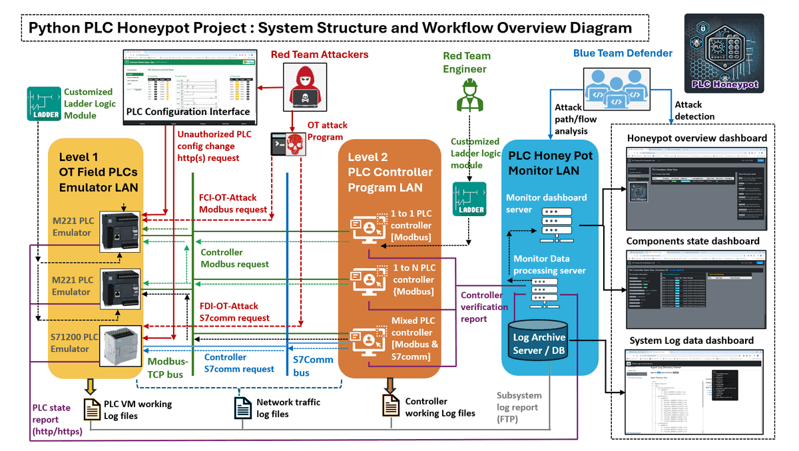
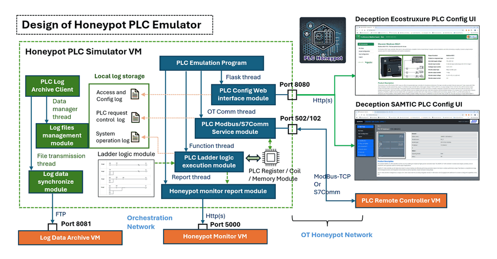
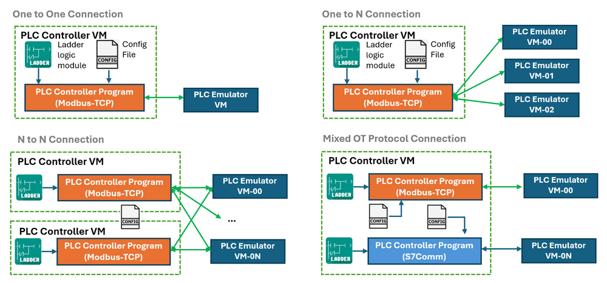
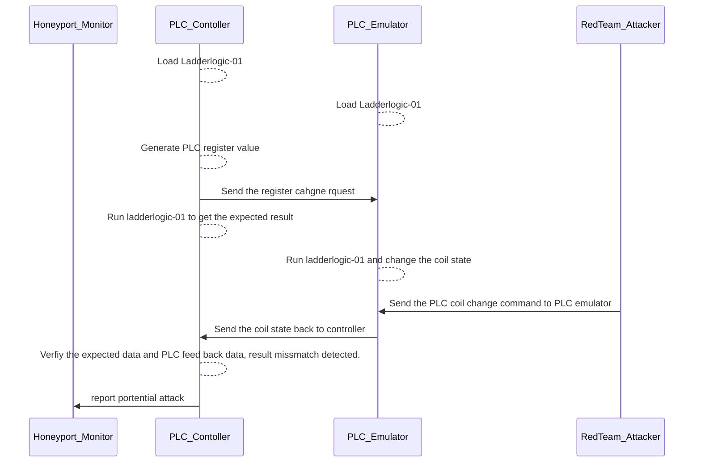
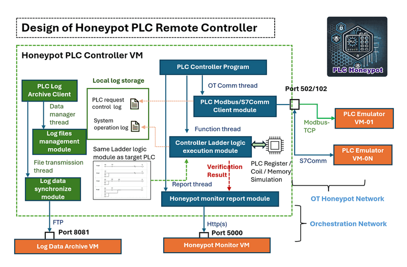
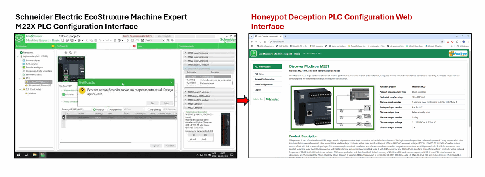
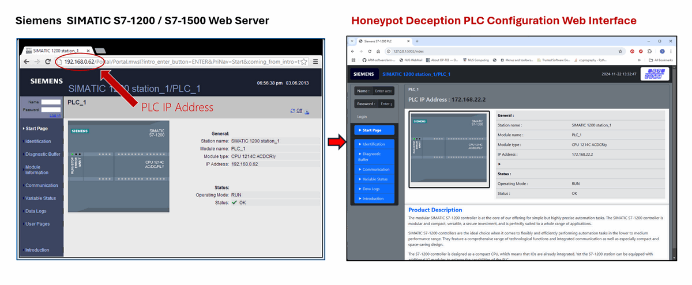

# Python PLC Honey Pot Project [under development]


**Program Design Propose** : This project aims to develop a sophisticated honeypot system that emulates an OT (Operational Technology) SCADA network environment, bridging Level 1 OT field controller devices (PLCs) with Level 2 control programs, including Human-Machine Interfaces (HMIs). This honeypot will simulate various PLC models from major vendors, such as Schneider and Siemens, while supporting the primary communication protocols `Modbus-TCP` and `Siemens-S7Comm`. The system will integrate essential components: PLC emulator, OT controller simulator, ladder logic verifier, data logger, attack detector and system monitor. 

As a cybersecurity honeypot, this project will detect unauthorized access attempts on PLCs, including attempts to log in to PLC configuration pages via HTTP/HTTPS, and will monitor for possible attack scenario such as Denial of Service (DoS),  False Command Injection (FCI) and False Data Injection (FDI) attacks. The system will log and display real-time data on system execution states, enabling defenders or blue teams to monitor and analyze attacker or red team behaviors. Designed for cybersecurity training, cyber defense exercises, Capture the Flag (CTF) challenges, and hands-on attack/defense competitions, this PLC honeypot provides a realistic and interactive platform for advancing OT cybersecurity skills and strategies.

```
# Created:     2024/10/28
# Version:     v_0.0.1
# Copyright:   Copyright (c) 2024 LiuYuancheng
# License:     MIT License      
```

**Table of Contents**

[TOC]

------

### Introduction

The Python PLC Honeypot Project is a distributed cybersecurity solution designed to mimic the behavior of real SCADA network control flows between Programable Logic Controllers (PLCs) and Human-Machine Interfaces (HMIs), the honey pot is a full digital equivalent VM based system without any special OT-hardware. This system lures potential red team attackers into engaging with a simulated OT (Operational Technology) environment, enabling the collection of attack data, Digital Forensics and Incident Response (DFIR) datasets, and supporting the development of enhanced security measures. It also provides a platform for blue team defenders to monitor, analyze, and respond to cyber threats in industrial environments. The system is divided into three main subsystems:

- **PLC Emulators Subsystem**: The subsystem includes multiple `PLC_Emulation_VM`s to simulate Schneider Modicon M22X (Modbus-TCP) and Siemens S712xx (S7Comm) PLCs, capable of handling OT control requests and executing ladder logic to replicate realistic PLC behaviors. 
- **PLC Controllers Subsystem**: The subsystem includes multiple `PLC_Contoller_VM`s to mimics various control workflows (1-to-1, 1-to-N, and N-to-N HMI-PLC interactions) in OT environments, validating control interactions and reporting verification states to the monitoring system.
- **Honeypot Monitor Subsystem**: The subsystem includes one `Monitor_Hub_VM` and one `Log_Archive_Database_VM` to aggregate and process reports from PLC emulators, controllers, and network logs. It provides visualization, alerts, and notifications to defenders via different web based interactive dashboard.

The system structure and workflow diagram is shown below:



The system operates across two isolated networks:

- **OT Honeypot Network**: Open to red team attackers for penetration testing, scanning, and OT protocol-based attacks. This network includes OT protocol communication between PLC emulators and controller simulators and provides access to PLC configuration interfaces via HTTP/HTTPS.
- **Orchestration Network**: Restricted to blue team defenders, this network centralizes monitoring, reporting, and log data archival. It also facilitates data flow between system components and the monitoring hub.

#### System Key Features Introduction

The PLC honey port System include below eight main features:

- **[1] PLC Emulation** : Provides realistic OT protocol simulations, ladder logic execution, and vendor-like PLC configuration interfaces. Emulates control logic to respond to OT requests, commands, simulating I/O operations and process control behaviors.
- **[2] Customizable OT Network** : Supports flexible and customizable configurations for building simple  (1 controller to 1 PLC ) or complex (N controllers to N PLCs) OT network structures, enabling the honeypot to act as a realistic, discoverable system with intentional vulnerabilities (e.g., open ports, weak authentication) to lure attackers
- **[3] Data Logging and Monitoring** : Records all actions, including attacker commands, config changes, control requests, system responses, and unauthorized access attempts. Log files from PLC emulators and controllers are synchronized to the log archive server for real-time tracking and historical analysis.
- **[4] Attack and Forensics Analysis**: Each components in the honeypot will collect the forensic data and report regularly, such as packet traces, login attempts, command logs, and abnormal behavior, for detailed post-incident analysis.
- **[5] Deception Layer for Attacker** : The controller will simulates realistic OT control systems by generating periodic and random PLC control requests. The emulator also provides highly convincing fake PLC configuration interfaces (90% similar) that mimic real vendor designs to deceive attackers into believing they are interacting with actual devices.
- **[6] Alerting and Notification System**: Each components will generate warnings and alerts for abnormal interactions, such as port scans, unauthorized logins, or configuration changes, then report the monitor hub. The monitoring hub consolidates reports to provide system-wide alerts for defenders.
- **[7] Integration with Security Infrastructure**: The system offers HTTP APIs to facilitate integration with Security Information and Event Management (SIEM) systems for centralized logging, alerting, and analysis.
- **[8] Management Console**: Provides different dashboards for real-time data visualization, system alerts, and performance analysis. Users can configure, monitor, and control various aspects of the honeypot through an intuitive interface.

This project provides a robust platform for cybersecurity training, testing, and research, contributing to improved resilience in industrial control systems. It has been used in two international CTF competition in Singapore and Europe. 


------

### System Design

This section will show the design of each part of the sub system. 

#### Design of PLC Emulator

The PLC Emulator will run on a VM or a physical machine with 2 programs (PLC Emulation Program and the Log archive agent) in the honey pot. The PLC simulation program will provide OT protocol simulations, ladder logic execution, and vendor-like PLC configuration interfaces. Emulates control logic to respond to OT requests, commands, simulating I/O operations and process control behaviors. The Log archive agent will use FTP to synchronize all the needed log of the Emulator to the log file server. The system diagram is shown below:



The PLC Emulation Program will start 4 sub parallel threads: 

- **Flask Web Host Thread** : Host a web host to provide the deception PLC config web interface to lure attacker access and track all the attackers action. 
- **Modbus and S7Comm Thread** : Start a Modbus-TCP server or a S7Comm server to handle the related OT request. 
- **PLC Function thread** : The function module to manage the Register, coils and memory changes and execute the imported ladder logic. 
- **Monitor Report thread** :  Regular report the PLC execution state, abnormal situation ( warning and alert ) to the honey port monitor hub. 

The PLC Emulation Program will generate the access and configuration change log, the OT control log and system log, then save them in local storage, the Log archive client will filter the log and upload the log to honey port archive server. The Log archive client will start 2 sub parallel thread: 

- **Log file management thread**: A file manager module to manage the log files in the local log storage to categorize, filter and record the new generated or modified or archived files. 
- **Log synchronization thread**: A FTP client with a file synchronization queue to upload the new created file to the log data archive server.  


#### Design Of PLC Controller

For each PLC controller, it will start a OT protocol client thread to connect to the related PLC emulator (VM) based on the configuration. simulate the complex HMI-PLC control flow, user can run multiple PLC controller program in one VM and load in different PLC ladder logic to simulate the 1 to N or N to N or mixed SCADA system control scenario. The connection diagram is shown below:



After the controller initialized, it will load the exactly same Registers state, Coils state, memory config and Ladder logic module as its target PLC, then when the controller start one around control and verification, it will generate the random PLC register or coil or memory change setting, then pass the data to the PLC controller, then it will also simulate run the logic itself to get the calculated expected result `r0`, then it will fetch the PLC execution result `r1` from the PLC emulator. Then the controller will compare whether the `r0` and `r1` are same, if they are same, the controller will report normal to the monitor and wait for the next execution around, if different it will report warning to the monitor, if the controller detect the mismatch happens 3 time, it will report PLC has been attacked alert to the monitor. The verification workflow to detect a false command injection attack is shown below:



The Controller workflow is shown below:



The PLC Emulation Program will start 3 sub parallel threads: 

- **OT Communication Thread**:  Login to the related target PLC(s) to send control request and read the feed back state. 
- **Function thread**: Generate the control request data and verify the PLC execution result. 
- **Monitor Report thread** :  Regular report the controller execution state, abnormal situation ( warning and alert ) to the honey port monitor hub. 

Same as the PLC Emulator, each controller VM will run one log agent to send the log to the log archive server.


#### Deception Layer Design 

For the OT deception layer for the attacker, as introduced in the PLC emulator and controller design, the system will provide the access limitation, data type verification, PLC permission IP white list function to mimic the real industrial environment. For the PLC emulator, we also provide the web PLC config interface which follow the same design and use the same port of the real PLC's web interface, so when the attack did the network IP and port scanning, they can access the config page which make them believe that they are accessing the real PLC.

For PLC emulator to simulate different vendor's PLC we also follow the same style of the real PLC's configuration UI to create our fake interface. 

For the M221 PLC Emulator, we follow the Schneider Electric EcoStruxure Machine Expert M22X PLC Configuration Interface and create the Deception interface as shown below:



For the S71200 PLC Emulator, we follow the Siemens SIMATIC S7-1200 / S7-1500 Web Server PLC Configuration interface and create the Deception interface as shown below:

All the deception interface also provide the PLC real time I/O state display, register and coil state, ladder logic diagram display, access limitation, network configuration,  user configuration and the user manual download function which mimic the real PLC's function to lure the attacker. 


------


The PLC honey port System include below eight main features:

- **[1] PLC Emulation** : the PLC emulator will provide customization of real OT protocol simulation, PLC ladder logic execution, PLC configuration interface and PLC information (like model type, firmware version, and IP address) to imitate various real-world PLCs. It mimics the control logic processing to respond to commands realistically, including simulating I/O operations and process control behavior.
- **[2] Customizable OT network** : The system provide the flexible network communication configuration for green team or user to build simple (1 controller to 1 PLC ) or complex (N controllers to N PLCs) OT network structure. It allows the honeypot to be discovered on the network, acting like a real PLC-Controller system and Creates intentional vulnerabilities (e.g., open ports, weak authentication) to lure attackers.
- **[3] Data Logger and Monitor** : All the action such as commands sent by attackers, responses given by the honeypot, and any unauthorized access attempts. will be recorded by the each PLC and controller module in each VM's log files and synchronize to the Log archive server in the orchestration network which Enables real-time tracking of interactions, allowing administrators to observe and respond to incidents.
- **[4] Attack and Forensics Analysis** : Each components in the honeypot will report the forensic data such data access, packet traces, login and command logs, configuration changes and especially abnormal system behavior, for post-incident analysis.
- **[5] Deception Layer for Attacker** : The controller will continuous generate periodically and random PLC state fetching and control request to create the illusion of a real-world complex OT control system engage attackers, at the same time each PLC will also provide the "fake" configuration interface which user interface is 90% similar as the vender's real PLC configureUI to make the attackers believe they are connecting to the real physical device.
- **[6] Alerting and Notification System** : Each components will provide abnormal report function, if the component detected abnormal interaction with other port it will evaluate its own state and report to the monitor hub, such as if a port scan it touch to the system it will report a warning and if an authorization login or config change (change PLC allow read IP address) the PLC will report an alert. The monitor will evaluate the whole system state based all the components report then create the alert notification for the defense team.

- **[7] Integration with Security Infrastructure** : The system provide different http API to transfer the data or integrate or connect with other Security Information and Event Management (SIEM) systems for centralized logging, alerting, and analysis.
-  **[8] Management Console** : the honeypot monitor hub provides different dashboard interface to Displays real-time data and alerts, allowing security teams to manage and analyze the honeypot's performance. User can also use different API interface to check,  configure, and control various aspects of the honeypot.


------


We want to create a python PLC honey pot system with below features:

### 1. **PLC Emulator**

- **Protocol Emulation**: Simulates communication protocols (e.g., Modbus, S7Comm, DNP3, EtherNet/IP) to make the honeypot behave like a real PLC.
- **Control Logic Simulation**: Mimics control logic processing to respond to commands realistically, including simulating I/O operations and process control behavior.
- **Configurable Device Profile**: Allows customization of device settings like model type, firmware version, and IP address to imitate various real-world PLCs.

### 2. **Network Interface**

- **IP Configuration**: Allows the honeypot to be discovered on the network, acting like a real PLC.
- **Vulnerability Simulation**: 
- **Network Visibility**: Integrates with network infrastructure to monitor and capture traffic directed to the honeypot.

### 3. **Data Logger and Monitor**

- **Interaction Logging**: Records all communications, including commands sent by attackers, responses given by the honeypot, and any unauthorized access attempts.
- **Packet Capturing**: Captures network traffic for deeper analysis of attack methods.
- **Real-time Monitoring**: Enables real-time tracking of interactions, allowing administrators to observe and respond to incidents.

### 4. **Alerting and Notification System**

- **Automated Alerts**: Sends notifications to administrators when specific events or suspicious activities are detected (e.g., repeated login attempts, abnormal commands).
- **Event-Based Triggers**: Configurable to trigger alerts based on predefined rules, making it easier to detect ongoing attacks.

### 5. **Attack Analysis and Forensics Module**

- **Data Analysis Tools**: Analyzes captured data to identify patterns and techniques used by attackers.
- **Forensic Data Collection**: Gathers evidence, including packet traces, command logs, and system behavior, for post-incident analysis.
- **Reporting**: Generates detailed reports on detected activities, providing insights into potential vulnerabilities and attack vectors.

### 6. **Deception Layer**

- **Fake System Environment**: Simulates a larger network or industrial setup, creating the illusion of a more complex control system to engage attackers.
- **Bait Mechanisms**: Includes features like fake data, open services, and apparent vulnerabilities to make the system more appealing to attackers.

### 7. **Integration with Security Infrastructure**

- **SIEM Integration**: Connects with Security Information and Event Management (SIEM) systems for centralized logging, alerting, and analysis.
- **Threat Intelligence Feeds**: Shares information on detected threats with threat intelligence platforms, helping to build a broader defense strategy.

### 8. **Management Console**

- **Configuration Management**: Provides a user interface to set up, configure, and control various aspects of the honeypot.
- **Monitoring Dashboard**: Displays real-time data and alerts, allowing security teams to manage and analyze the honeypot's performance.
- **Remote Access**: Enables administrators to manage the system remotely, ensuring flexibility in monitoring and response.

These components work together to create a **comprehensive PLC honeypot system** that not only mimics real PLCs but also effectively captures attacker behaviors, gathers intelligence, and enhances the overall security posture of industrial environments.