# Python PLC Honeypot User Manual


Welcome to the **Python PLC Honeypot User Manual**! This manual provides detailed step-by-step instructions on how to deploy and use the honeypot system in your environment for detecting potential attacks on OT (Operational Technology) networks. The guide includes two main section:

- **Honeypot deployment**: an example deployment of a mixed OT protocol honeypot, consisting of a simple setup with two 1-to-1 emulator-controller pairs. As a Green Team engineer, you'll learn how to configure and deploy the honeypot, ensuring seamless operation in your environment.

- **Attack detection case study**: From the perspective of a Blue Team defender, this manual will walk you through how to monitor the system, analyze alerts, and detect sophisticated attack strategies such as false data injection or man-in-the-middle (MITM) attacks carried out by a Red Team attacker.

**Table of Contents**

[TOC]

------

### Honeypot Deployment

To deploy the honeypot system, a minimum of six virtual machines (VMs) or physical machine are required, along with two isolated networks connected through two network switches. Each VM for the PLC controllers and emulators must have two network interfaces: one for the **OT Honeypot Network** and another for the **Orchestration Network**. The network topology is illustrated below:

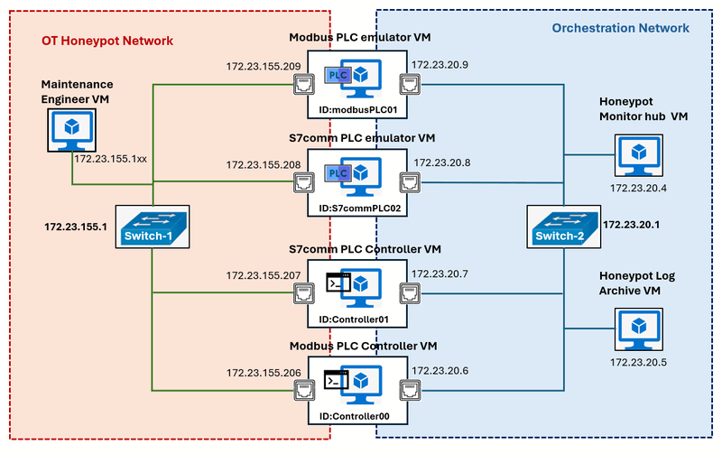

The recommended operating system for all VMs is **Ubuntu 22.04**, ensuring compatibility with the honeypot modules and libraries. The deployment should follow the sequence outlined in the table below:

| VM Name                      | Deploy Sequence | Honeypot IP    | Orchestration IP | Program/Module Needed                             |
| ---------------------------- | --------------- | -------------- | ---------------- | ------------------------------------------------- |
| **Honeypot Monitor hub VM**  | 1               | N.A            | 172.23.20.4      | `lib` , `honeypotMonitor`                         |
| **Honeypot Log Archive VM**  | 2               | N.A            | 172.23.20.5      | `lib`, `honeypotLogServer`                        |
| **Modbus PLC emulator VM**   | 3               | 172.23.155.209 | 172.23.20.9      | `lib`, `modbusPlcEmulator`, `honeypotLogClient`   |
| **Modbus PLC Controller VM** | 4               | 172.23.155.206 | 172.23.20.6      | `lib`, `modbusPlcController`, `honeypotLogClient` |
| **S7comm PLC emulator VM**   | 5               | 172.23.155.208 | 172.23.20.8      | `lib`, `s7commPlcEmulator`, `honeypotLogClient`   |
| **S7comm PLC Controller VM** | 6               | 172.23.155.207 | 172.23.20.7      | `lib`, `s7commPlcController`, `honeypotLogClient` |

For details on the required modules, refer to the **Program File List** section in the system setup portion of the **README** file. Each VM must also have the necessary libraries installed according to the setup instructions provided.


#### Deploy Honeypot Monitor Hub VM

**Step1: Setup program files** 

- Follow the program setup instructions in readme file to install the required libraries.
- Create a program directory structure: `monitor/src` in the machine or VM.
- Copy the `lib` and `honeypotMonitor` modules into the `src` folder.

**Step2: Change the application configuration file**

- Rename the `src/honeypotMonitor/config_template.txt` to `src/honeypotMonitor/config.txt` 
- Change the `FLASK_SER_PORT:5000` if you need to set another port for the monitor web (such as 8080). 

**Step3: Run the Monitor Hub program**

- Navigate(cd) to the `honeypotMonitor`  folder and run the monitor hub program with command `sudo python3 monitorApp.py` . 
- In the orchestration network open a browser and visit  URL **http://172.23.20.4:5000** to  verify that the monitor hub is online, as shown below:

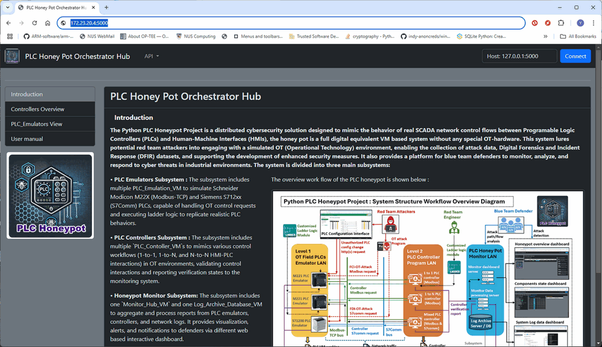


#### Deploy Honeypot Log Archive VM

**Step 1: Setup the program**

- Follow the program setup instructions in readme file to install the required libraries.
- Create a directory structure: `logServer/src` in the machine or VM.
- Copy the `lib` and `honeypotLogServer` modules into the `src` folder.

**Step 2: Configure the application**

- Rename the configuration files as follows : `src/honeypotLogServer/ServerConfig_template.txt` → `src/honeypotLogServer/ServerConfig.txt` and `src/honeypotLogServer/userRecord_template.json` → `src/honeypotLogServer/userRecord.json`
- Update the agent's credentials in `userRecord.json` by adding the login password:

```json
"agent": {
    "passwd": "123456",
    "perm": "elradfmwM"
}
```

- Modify the configuration file `ServerConfig.txt` to disable test mode by changing the following line:

```
...
line06: # Web test mode flag: True start without init the FTP server
line07: TEST_MODE:False
...
```

**Step 3: Run the Log Archive Program**

- Navigate to the `honeypotLogServer` folder and run the log archive server application with command `sudo python3 logArchiveServerApp.py`
- In the orchestration network open a browser visit **[http://172.23.20.5:5003](http://172.23.20.5:5003/)** to verify that the log archive server is online, as shown below:

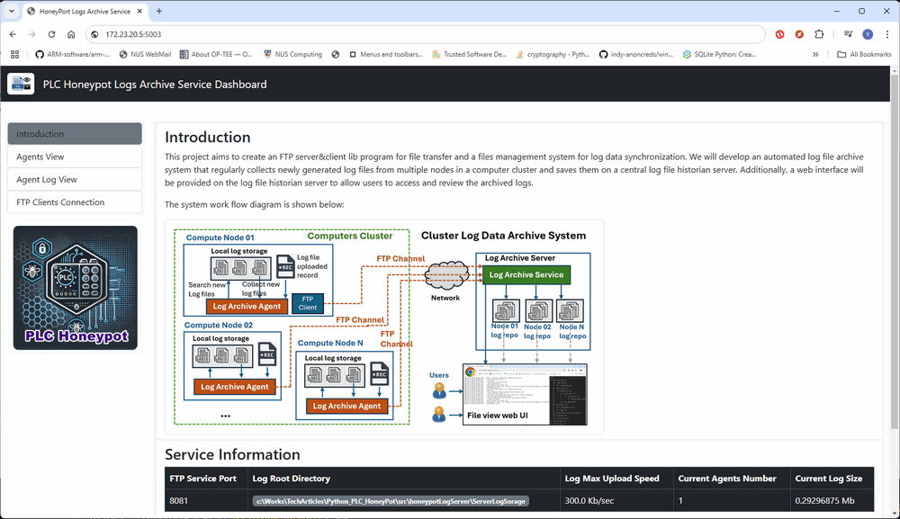


#### Deploy Modbus PLC Emulator VM

**Step 1: Setup the program**

- Follow the program setup instructions to install the required libraries.
- Create a directory structure: `plcEmulator/src`.
- Copy the following modules into the `src` folder: `lib`, `honeypotLogClient`, and `modbusPlcEmulator`.

**Step 2: Configure and Deploy the Log Archive Client Program**

- Rename the file `src/honeypotLogClient/AgentConfig_template.txt` to `src/honeypotLogClient/AgentConfig.txt`.
- Edit the `AgentConfig.txt` file and configure the following parameters:  `PLC ID`, `IP address`, `Log server IP`, `Log folder name` as shown below:

```
#-----------------------------------------------------------------------------
# Unique Agent ID, all the log file will be saved in the server's home/<AGENT_ID>/ folder
AGENT_ID:modbusPLC01
AGENT_IP:172.23.155.209
#-----------------------------------------------------------------------------
# FTP server info and login credentials, don't upload the credentials to the Github
FTP_SER_IP:172.23.20.5
FTP_SER_PORT:8081
USER_NAME:agent
USER_PWD:P@ssw0rd
...
#-----------------------------------------------------------------------------
# local folder save the log files. 
LOG_DIR:../Logs
...
```

- Run the log archive client program with command `python3 logArchiveAgent.py` 
- Open the archive server's web agent list page (Agents View tag) to check whether the log archive agent has registered and connected successfully:

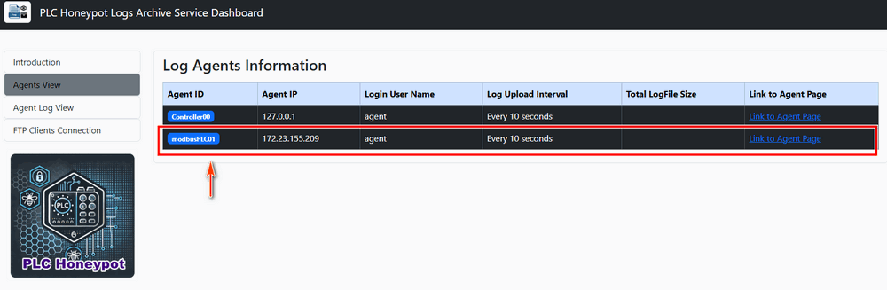


**Step 3: Configure and Deploy the PLC Emulator Program**

- Rename the file `src/modbusPlcEmulator/config_template.txt` to `src/modbusPlcEmulator/config.txt`.
- Edit the `PLC ID`, `IP address`, add `controller's IP address` in allow read and write list, edit `monitor hub IP address` and `port` as shown below:

```
# This is the config file template for the PLC honeypot project's Modbus PLC 
# emulator program <modbusPlcApp.py>
# Setup the parameter with below format (every line follows <key>:<value> format, the
# key can not be changed):
#-----------------------------------------------------------------------------
# OwnID should not include space or other special characters.
Own_ID:modbusPLC01
Own_IP:172.23.155.209
# The OT protocol type string, "Modbus" or "S7Comm".
PRO_TYPE:Modbus
# The ladder logic file id used by this PLC emulator.
LADDER_ID:mbLadderLogic.py
#-----------------------------------------------------------------------------
# Define the ip addresses allowed to read PLC state: 
# json list format: ["masterIP", "slave1IP", ...]
ALLOW_R_L:["172.23.155.206"]
# Define the ip addresses allowed to change PLC state: 
# json list format: ["masterIP", "slave1IP", ...]
ALLOW_W_L:["172.23.155.206"]
#-----------------------------------------------------------------------------
# define the monitor hub parameters : 
MON_IP:172.23.20.4
MON_PORT:5000
# Time interval to report to the monitor hub in seconds:
RPT_INTERVAL:5
#-----------------------------------------------------------------------------
# Init the PLC local web Flask app parameters
FLASK_SER_PORT:5001
FLASK_DEBUG_MD:False
FLASK_MULTI_TH:True
# The PLC local web  use credential record file 
USERS_RCD:users.json
```

- Rename the user credential file `src/modbusPlcEmulator/users_template.json` to `src/modbusPlcEmulator/users.json`.
- Run the Modbus PLC emulator program with command `sudo python3 modbusPlcApp.py`
- Open a browser in the honeypot network and visit **[http://172.23.155.209:5001](http://172.23.155.209:5001/)** to verify that the emulator's web interface is online, as shown below:

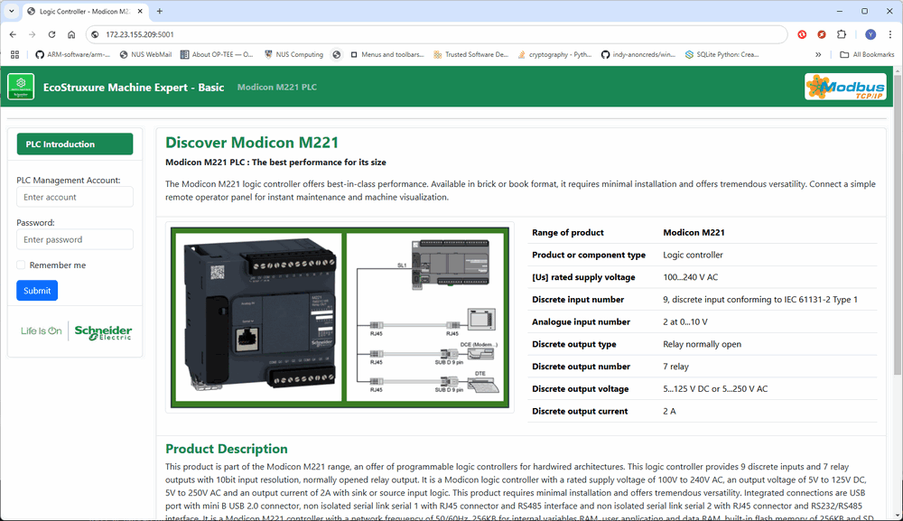

- Then access the monitor hub through the orchestration network and confirm that the PLC emulator has registered successfully, as shown below:


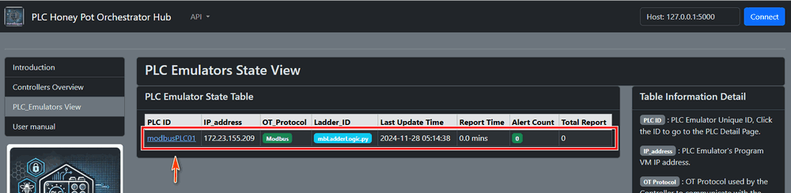


#### Deploy Modbus PLC Controller VM

**Step 1: Set Up the Program**

- Follow the program setup instructions in readme file to install the required libraries.
- Create the directory structure: `plcController/src`.
- Copy the following modules into the `src` folder: `lib`, `honeypotLogClient`, and `modbusPlcController`.

**Step 2: Configure and Deploy the Log Archive Client Program**

- Rename the file `src/honeypotLogClient/AgentConfig_template.txt` to `src/honeypotLogClient/AgentConfig.txt`.
- Edit the `AgentConfig.txt` file to include the following details:  `PLC ID`, `IP address`, `Log server IP`, `Log folder name`  as shown below:

```
#-----------------------------------------------------------------------------
# Unique Agent ID, all the log file will be saved in the server's home/<AGENT_ID>/ folder
AGENT_ID:Controller01
AGENT_IP:172.23.155.206
#-----------------------------------------------------------------------------
# FTP server info and login credentials, don't upload the credentials to the Github
FTP_SER_IP:172.23.20.5
FTP_SER_PORT:8081
USER_NAME:agent
USER_PWD:P@ssw0rd
...
#-----------------------------------------------------------------------------
# local folder save the log files. 
LOG_DIR:../Logs
```

- Run the log archive client program with command `python3 logArchiveAgent.py` 
- Open the log archive server's agent list page to verify that the log archive client has registered and connected successfully:

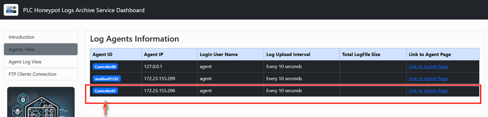


**Step 3: Configure and Deploy the PLC Controller Program**

- Rename the `src/modbusPlcController/config_template.txt` to `src/modbusPlcController/config.txt`,  
- Edit the Controller ID, IP address, target PLC ID, IP, port  monitor hub IP address and port as shown below:

```
# This is the config file template for the  the PLC honeypot project's Modbus PLC 
# controller program <mbPlcControllerApp.py>
# Setup the parameter with below format (every line follows <key>:<val> format, the
# key can not be changed):
#-----------------------------------------------------------------------------
OWN_ID:Controller01
OWN_IP:172.23.155.206
# The OT protocol type string, "Modbus" or "S7Comm".
PRO_TYPE:Modbus
# The ladder logic file id used by this PLC controller.
LADDER_ID:mbLadderLogic.py
#-----------------------------------------------------------------------------
# The PLC ID and IP address, the ID must be same as the 
PLC_ID:modbusPLC01
PLC_IP:172.23.155.209
PLC_PORT:502
# PLC data fetch time interval (sec)
PLC_CINT:10
#-----------------------------------------------------------------------------
# define the monitor hub parameters : 
MON_IP:172.23.20.4
MON_PORT:5000
# Time interval to report to the monitor hub in seconds:
RPT_INTERVAL:5
```

- Run the Modbus PLC controller program `sudo python3 mbPlcControllerApp.py`
- Verify that the PLC controller is registered with the monitor hub by accessing the monitor hub through the orchestration network as shown below:

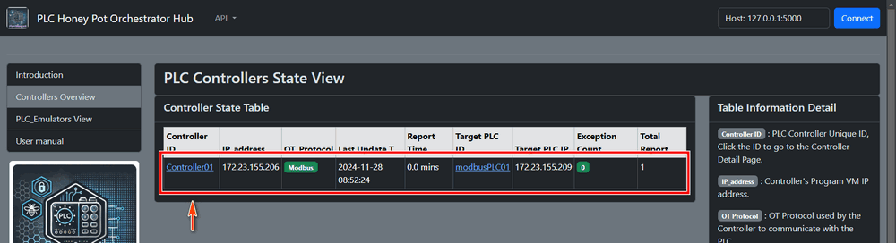


#### Deploy S7Comm PLC Emulator VM

**Step 1: Set Up the Program**

- Follow the program setup section to install the required libraries.
- Create the directory `plcEmulator/src`.
- Copy the following modules into the `src` folder:  `lib` , `honeypotLogClient` `s7commPlcEmulator` 

**Step 2: Configure and Deploy the Log Archive Client Program**

Rename the file `src/honeypotLogClient/AgentConfig_template.txt` to `src/honeypotLogClient/AgentConfig.txt`.

- Edit the `AgentConfig.txt` file with the following information: PLC ID, IP address, log server IP, log folder name as shown below:

```
#-----------------------------------------------------------------------------
# Unique Agent ID, all the log file will be saved in the server's home/<AGENT_ID>/ folder
AGENT_ID:S7commPLC02
AGENT_IP:172.23.155.208
#-----------------------------------------------------------------------------
# FTP server info and login credentials, don't upload the credentials to the Github
FTP_SER_IP:172.23.20.5
FTP_SER_PORT:8081
USER_NAME:agent
USER_PWD:P@ssw0rd
...
#-----------------------------------------------------------------------------
# local folder save the log files. 
LOG_DIR:../Logs
```

- Run the log archive client program using the command: `python3 logArchiveAgent.py` 
- Verify that the client registers and connects to the archive server by checking the agent list page. This process is similar to the configuration for the Modbus PLC Emulator VM.

**Step 3: Configure and Deploy the PLC Emulator Program**

- Rename the file `src/s7CommPlcEmulator/config_template.txt` to `src/s7CommPlcEmulator/config.txt`.
- Edit the `config.txt` file with the following details: PLC ID, IP address, monitor hub IP address and port as shown below:

```
# This is the config file template for the PLC honeypot project's S7Comm PLC 
# emulator program <S7CommPlcApp.py>
# Setup the parameter with below format (every line follows <key>:<value> format, the
# key can not be changed):
#-----------------------------------------------------------------------------
# OwnID should not include space or other special characters.
Own_ID:S7commPLC02
Own_IP:172.23.155.208
# The OT protocol type string, "Modbus" or "S7Comm".
PRO_TYPE:S7Comm
# The ladder logic file id used by this PLC emulator.
LADDER_ID:s7LadderLogic.py
#-----------------------------------------------------------------------------
# define the monitor hub parameters : 
MON_IP:172.23.20.4
MON_PORT:5000
# Time interval to report to the monitor hub in seconds:
RPT_INTERVAL:5
#-----------------------------------------------------------------------------
# Init the PLC local web Flask app parameters
FLASK_SER_PORT:5002
FLASK_DEBUG_MD:False
FLASK_MULTI_TH:True
# The PLC local web  use credential record file 
USERS_RCD:users.json
```

- Rename the user credential file `src/s7CommPlcEmulator/users_template.json` to `src/s7CommPlcEmulator/users.json`.

- Run the S7Comm PLC emulator program with command `sudo python3 s7commPlcApp.py` .
- In the honeypot network, access the URL `http://172.23.155.208:5002` to verify that the PLC emulator is ready as shown below:

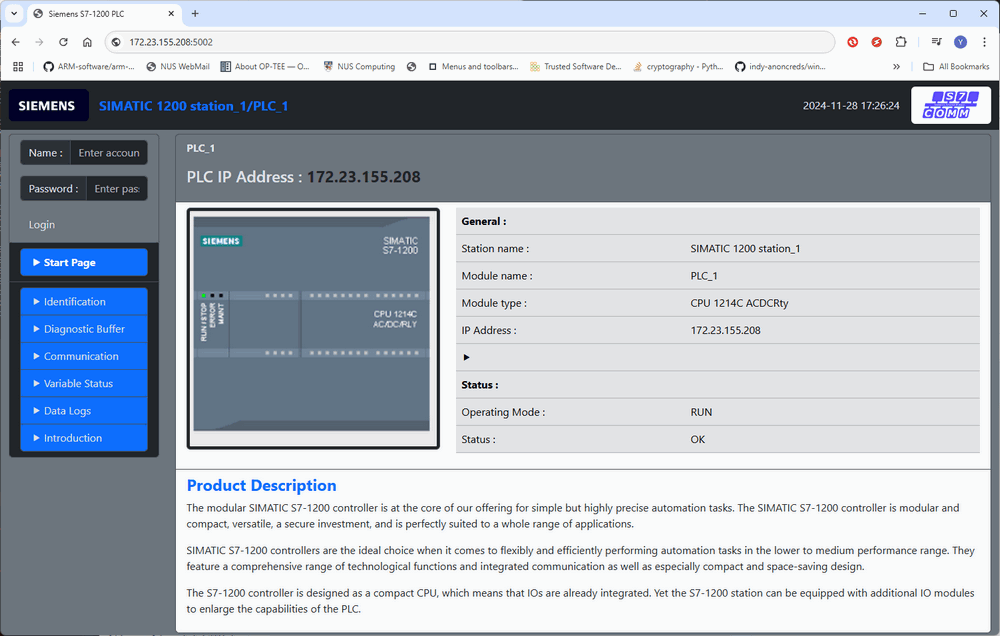

- Check the monitor hub to ensure the emulator is registered. This process is similar to the Modbus PLC Emulator VM setup.


#### Deploy S7Comm PLC Controller VM

**Step 1: Set Up the Program**

- Follow the program setup section to install the required libraries.
- Create the directory `plcController/src`.
- Copy the following modules into the `src` folder: `lib` , `honeypotLogClient`,  `s7commPlcController` 

**Step 2: Configure and Deploy the Log Archive Client Program**

- Rename the file `src/honeypotLogClient/AgentConfig_template.txt` to `src/honeypotLogClient/AgentConfig.txt`.
- Edit the `AgentConfig.txt` file with the following details: `PLC ID`, `IP address`, `log server IP`, `log folder name` as shown below : 

```
#-----------------------------------------------------------------------------
# Unique Agent ID, all the log file will be saved in the server's home/<AGENT_ID>/ folder
AGENT_ID:Controller02
AGENT_IP:172.23.155.206
#-----------------------------------------------------------------------------
# FTP server info and login credentials, don't upload the credentials to the Github
FTP_SER_IP:172.23.20.5
FTP_SER_PORT:8081
USER_NAME:agent
USER_PWD:P@ssw0rd
...
#-----------------------------------------------------------------------------
# local folder save the log files. 
LOG_DIR:../Logs
```

- Run the log archive client program with command `python3 logArchiveAgent.py` 
- Verify the client registration on the archive server, similar to the Modbus PLC Controller VM configuration.

**Step 3: Configure and Deploy the PLC Controller Program**

- Rename the file `src/s7CommPlcController/config_template.txt` to `src/s7CommPlcController/config.txt`.
- Edit the `config.txt` file with the following configurations: PLC ID, IP address,  monitor hub IP address and port as shown below:

```
# This is the config file template for the  the PLC honeypot project's Modbus PLC 
# controller program <mbPlcControllerApp.py>
# Setup the parameter with below format (every line follows <key>:<val> format, the
# key can not be changed):
#-----------------------------------------------------------------------------
OWN_ID:Controller02
OWN_IP:172.23.155.207
# The OT protocol type string, "Modbus" or "S7Comm".
PRO_TYPE:S7Comm
# The ladder logic file id used by this PLC controller.
LADDER_ID:s7LadderLogic.py
#-----------------------------------------------------------------------------
# The PLC ID and IP address, the ID must be same as the 
PLC_ID:S7commPLC02
PLC_IP:172.23.155.208
PLC_PORT:102
# PLC data fetch time interval (sec)
PLC_CINT:10
#-----------------------------------------------------------------------------
# define the monitor hub parameters : 
MON_IP:172.23.20.4
MON_PORT:5000
# Time interval to report to the monitor hub in seconds:
RPT_INTERVAL:5
```

- Run the controller program with the command: `sudo python3 s7commPlcControllerApp.py`

- Verify that the controller is registered in the monitor hub through the orchestration network. This step is similar to the S7Comm PLC Emulator VM setup.


#### Deploy Ladder Logic In Emulator and Controller

Both the emulator and controller require the same ladder logic module to ensure proper simulation and control. You can use the provided example files, `src\s7commPlcEmulator\s7LadderLogic.py` or `src\modbusPlcEmulator\mbLadderLogic.py`, as templates to create your custom ladder logic.

The ladder logic is implemented using Python, allowing you to simulate complex logic operations. For instance, the following example demonstrates an 8-rung ladder logic that processes the values of 8 input holding registers and updates 8 output coils accordingly.

Ladder logic diagram example:


To simulate the ladder logic in Python, implement the `runLadderLogic()` function in your ladder logic module as shown below:

```python
    #-----------------------------------------------------------------------------
    def runLadderLogic(self, regsList, coilList=None):
        """ Execute the ladder logic with the input holding register list and set 
            the output coils. In this example, there will be 8 rungs to be executed.
        """
        # coils will be set ast the reverse state of the input registers' state. 
        if len(regsList) != 8: return None
        # rung 0: HR0 and HR2 -> Q0
        c0 = regsList[0] and regsList[7]
        # rung 1: not HR1 -> Q1
        c1 = not regsList[1]
        # rung 2: HR2 and HR3 and HR4 -> Q2
        c2 = regsList[2] and regsList[3] and regsList[4]
        # rung 3: not HR0 or HR6 -> Q3
        c3 = (not regsList[0]) or regsList[6]
        # rung 4: not (HR4 or HR5) -> Q4
        c4 = not (regsList[4] or regsList[5])
        # rung 5: (not HR0) and HR6 -> Q5
        c5 = (not regsList[0]) and regsList[6]
        # rung 6: HR3 or (not HR7) -> Q6
        c6 = regsList[3] or (not regsList[7])
        # rung 7: HR5 -> Q7
        c7 = regsList[5]
        return [c0, c1, c2, c3, c4, c5, c6, c7]
```

Both the PLC emulator and the controller will use this ladder logic module and call the `runLadderLogic()` function for execution and verification. This ensures consistency between the simulated PLC ladder logic and the control logic in the controller.


------

### Attack Detection Case Study

This case study demonstrates how to detect and respond to a **Modbus-TCP False Command Injection Attack** using the deployed honeypot system (introduced in the previous section). For details on attack alerts and notifications, refer to the *Alert and Notification* section in the README file.

In this scenario, an attacker attempts to compromise the target PLC in three key steps:

1. **Identify the Target**: Use `Nmap` to scan the network, identify the PLC, and discover open ports.
2. **Modify Access Permissions**: Attempt to read or write data to the PLC and access its configuration page to alter access permissions.
3. **Execute the Attack**: Launch a False Command Injection attack to manipulate PLC coil data by injecting incorrect commands.

The defender detects the attack path and uses the monitor hub’s reports to identify and respond to the attack. The diagram below illustrates the design of the attack scenario with the red team attack path and the blue team detection path: 

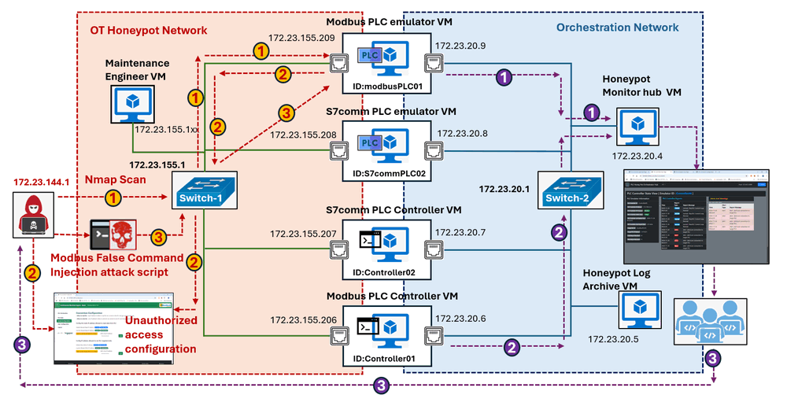

#### Attack Step 1: PLC Scanning and Command Attempt

The attacker initiates an **Nmap scan** to probe the target Modbus PLC's IP address(172.23.155.209) , as shown below:

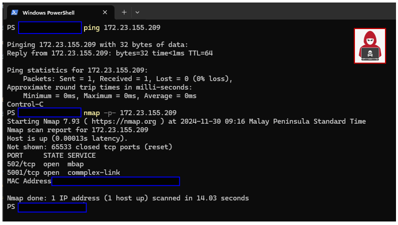

From the scan, the attacker identifies 2 open ports:

- **TCP Port 502**: Associated with the `mbap` service, indicating a Modbus-TCP server potentially running on a PLC device.
- **TCP Port 5001**: Associated with the `commplex-link` service, possibly hosting an HTTP(S) server.

The attacker performs the following actions:

- Sends `curl` requests to `http://172.23.155.209:5001` and `https://172.23.155.209:5001` to verify the HTTP service response.
- Creates a simple Modbus Read/Write client script to test read and write operations on the PLC:

```python
# A simple modbus IO program, for the lib modbusTcpCom, please refer to this link:
# https://github.com/LiuYuancheng/PLC_and_RTU_Simulator/blob/main/Modbus_PLC_Simulator/src/modbusTcpCom.py
import time
import modbusTcpCom
hostIp = '172.23.155.209'
hostPort = 502
client = modbusTcpCom.modbusTcpClient(hostIp)
print('Try to connect to the target PLC: %s' %str(hostIp))
while not client.checkConn():
    print('Try connect to the PLC')
    print(client.getCoilsBits(0, 4))
    time.sleep(0.5)
# Start the attack
print('Target PLC accept connection request.')
time.sleep(1)
while True:
    print("Inject wrong data...")
    rst1 = client.setCoilsBit(4, False)
    time.sleep(0.2)
    rst2 = client.setCoilsBit(6, True)
    time.sleep(0.5)
    if rst1 is None and rst2 is None: print("injection failed")
```

When running the script, read and write attempts fail because the attacker's IP (`172.23.144.1`) is not in the PLC’s **Allow Read/Write List**, the I/O request are rejected by the PLC.(As shown below)

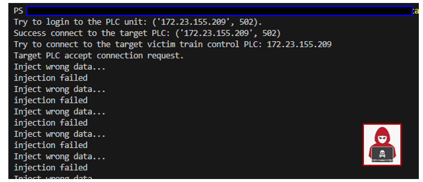

>  **Defender Response:** From the blue team side, the defenders check the monitor hub for `ModbusPLC01`'s state page and they can observe Port Touch Warnings for Nmap scans and `curl` actions as shown below:

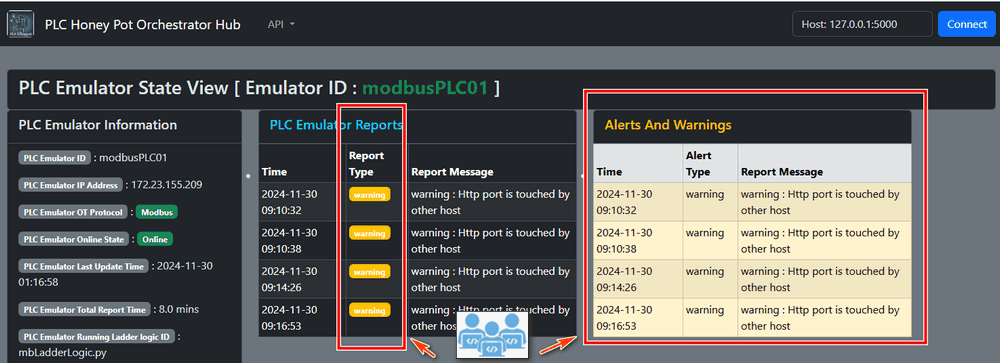


#### Attack Step 2: Logging into PLC Config Page and Modifying Access Permissions

The attacker accesses the PLC config page at `http://172.23.155.209:5001` using a browser. Upon identifying the device as an M221 PLC, the attacker searches online and finds default login credentials on this link:  https://www.se.com/eg/en/faqs/FAQ000241261/ . 

Using the default admin credentials, the attacker logs in, as shown:

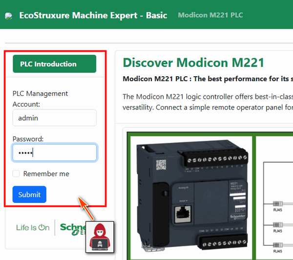

> **Defender Response:** The blue team observes login activity on the monitor hub. Although this is currently classified as normal, it can be configured to trigger a warning for admin user logins (based on the blue team's config):

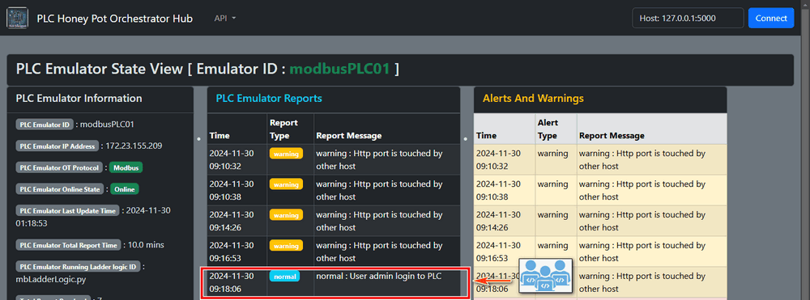

After successful gaining access PLC config interface, the attacker modifies the **Allow Write List**, adding his attack node IP (`172.23.144.1`) as shown below: 

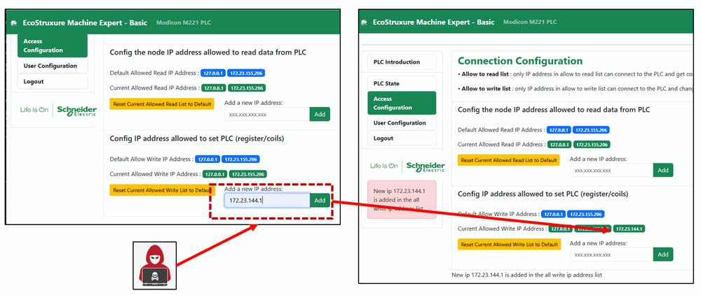

>  **Defender Response:** From the blue team side, the defender checked the monitor hub's PLC ModbusPLC01's state page, and find that some one is trying to add one unauthorized IP address in the PLC data access and modification list as shown below:

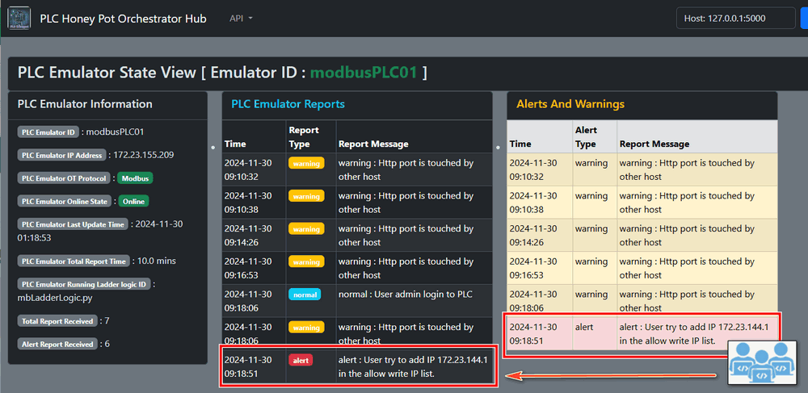

>  And based on the report, the blue team defender finds the attacker's IP address 172.23.144.1.


#### Attack Step 3: Executing False Command Injection (FCI)

Having modified the access permissions, the attacker reruns the Modbus client script. This time, the PLC accepts the injected coil data, as shown:

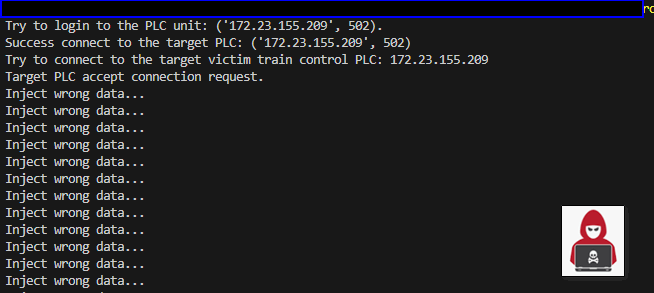

The attacker also confirms the changes via the PLC state page.

> **Defender Response: **The blue team checks the monitor hub's PLC Controller01's state page and detects unauthorized data modifications in the PLC state page and views detailed alerts on the monitor hub(as shown below):

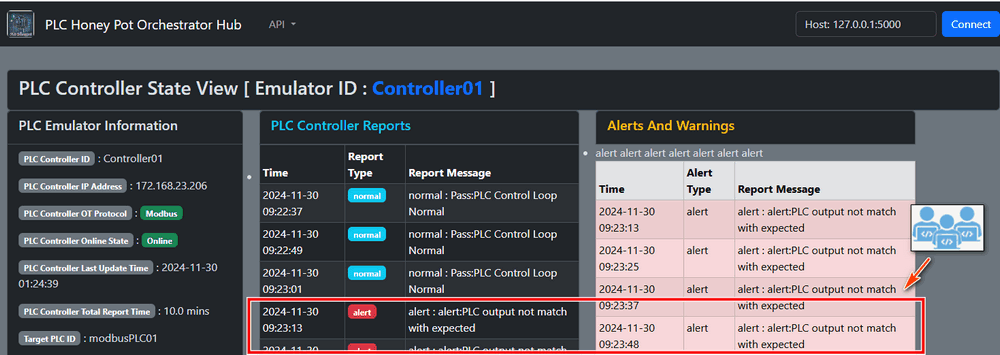

> The attack is detected. Now the blue team go to the log archive server web interface to check the controller's latest log:

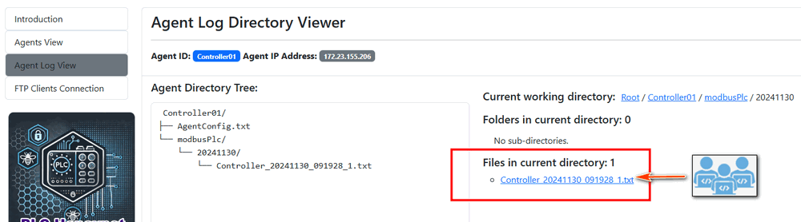

>  By accessing the log archive server, the defender reviews recent logs to identify specific changes made by the attacker. The logs confirm that **Coil 04** was set to `False` and **Coil 06** to `True` as shown below:


**Defender Response: Attack Timeline and Path Analysis**

The defender reconstructs the attack timeline based on the alerts and logs, as shown below:

| Time stamp                              | Attack Action                                                |
| --------------------------------------- | ------------------------------------------------------------ |
| 2024-11-30 9:10:23 am                   | Attack try to scan the PLC-ModbusPLC01(172.23.155.209) ports. |
| 2024-11-30 9:10:23 to 9:14:26           | Attacker try to prob the PLC-ModbusPLC01's http server.      |
| 2024-11-30 9:16:26                      | Attacker access the PLC main landing page from the attack nodes browser |
| 2024-11-30 9:18:06                      | Attacker use the PLC default admin account login to the PLC's configure interface. |
| 2024-11-30 9:18:51                      | Attacker added his attack node's IP 172.23.144.1 in the PLC's allow write list. |
| 2024-11-30 9:23:13                      | Attacker start the attack and try to modified the PLC data.  |
| 2024-11-30 9:23:13 - 2024-11-30 9:56:13 | Attacker keep send the PLC coil data change command to over write coil idx04 to False and coil idx06 to True. |

**Mitigation and Recovery**

- **Access Control Reset**: From the Orchestration Network, the defender disables the attacker’s user account and restores the correct Allow Write List.

- **Alert Escalation**: Configure login attempts by admin accounts as warnings.

- **Log Review**: Continuously monitor logs for unauthorized changes and suspicious activity.

  

------

> last edit by LiuYuancheng (liu_yuan_cheng@hotmail.com) by 30/11/2024 if you have any problem, please send me a message. 
